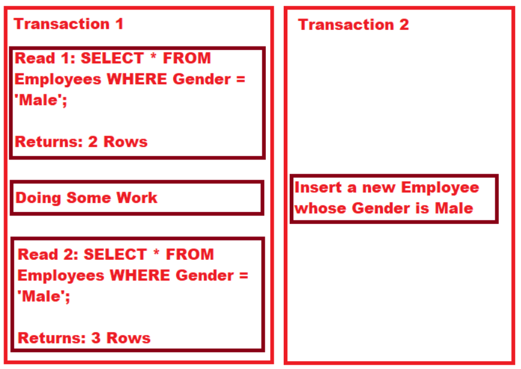
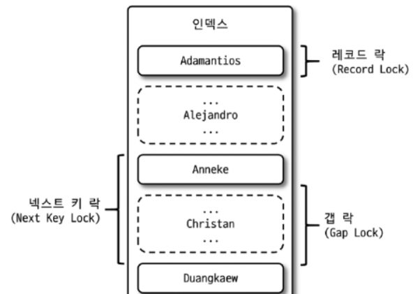

# 격리수준과 SELECT 쿼리 성능

## 개요

- MySQL의 InnoDB 스토리지 엔진은 REPEATABLE 격리수준을 기본 값으로 사용한다.
- 최근 특정 기능에 대해 READ_COMMITTED 격리 수준으로 쓰라는 리뷰를 받았는데 이유는 아래와 같았다.
  - SELECT 쿼리에서 특정 값에 해당하는 엔티티를 조회만 하기 때문에 굳이 phantom read를 막을 필요가 없기 때문이라는 말이었다.
- 이런 리뷰를 받은 것도 좋은데, 이 내용에 대해 알아 볼 생각에 심장이 두근거린다. 여기서 이 내용에 대해 정리해보자.

## REPEATABLE 격리수준

- REPEATABLE 격리수준을 쉽게 이야기하면 한 트랜잭션 내에서 select 결과가 같음을 보장한다.
- READ_COMMITTED 격리수준은 A 트랜잭션이 끝나기 전에, B 트랜잭션이 값을 변경하고 COMMIT 하면 A 트랜잭션이 SELECT 할 때 변경된 값이 조회된다. 즉 한 트랜잭션 내에서 SELECT 결과가 다를 수 있다.
- 일반적으로 REPEATABLE 격리수준에는 SELECT 개수가 달라질 수 있는 Phantom Read 현상이 발생하는데 MySQL의 InnodB 스토리지 엔진은 next key lock(record lock + gap lock)을 이용해 Phantom Read 현상을 막는다.

## Phantom Read

- SELECT 개수가 달라질 수 있는 Phantom Read 현상이 언제 발생하는지 아래 그림을 통해 알아보자.
  - 트랜잭션 1에서 남자를 조회해서 2개의 row를 얻었다.
  - 트랜잭션 1에서 잠시 다른일을 하는동안 트랜잭션 2에서 새로운 남자를 추가한다.
  - 트랜잭션 1에서 다시 남자를 조회하면 3개의 row를 조회하게 된다.


## MySQL은 Phantom Read를 어떻게 막을까

- 우선 MySQL의 InnoDB 스토리지 엔진의 잠금을 이해해야 한다.
- InnoDB는 하나의 레코드를 잠그는 레코드락, 레코드 사이의 간격을 잠그는 갭락, 이 둘을 합쳐서 넥스트 키락이라는 잠금을 사용한다.

- 테이블을 검색할 때 발견된(조회된) 레코드에 대해 레코드와 레코드 앞의 갭에 대해 락을 건다. 따라서 조회된 레코드를 수정할 수 없고, 레코드 앞의 갭에 락을 걸었기 때문에 레코드 앞에 데이터가 새로 추가될 수 없다.
- 또한 검색된 마지막 레코드 뒤에 갭락을 걸어서, 마지막 레코드의 다음 데이터를 추가할 수 없도록 락을 건다.

```sql
SELECT * FROM child WHERE id > 100
```

  - A 트랜잭션에서 위 쿼리를 통해 102, 105가 나왔다고 가정하자. 이 과정에서 이미 102, 105 레코드와 주변 갭은 락이 걸린 상태이다.
  - A 트랜잭션은 끝나지 않았고 이 떄 B 트랜잭션이 101을 추가한다면, 102 앞의 갭은 락이 걸려 추가할 수 없어 대기하게 된다. 마지막 레코드인 105 이후의 106도 마찬가지의 개념으로 대기하게 된다.

## 다시 격리수준과 SELECT

## READ_COMMITED로 바꾼 후 성능은?

- 테스트를 위해 30개의 다양한 컬럼(integer, varchar, enum, timestamp)을 가진 50만건의 랜덤 데이터를 만들었다.
- 격리수준을 각각 READ_COMMITTED, REPEATABLE로 설정한 상태에서 다른

## 결론

- it will be added
