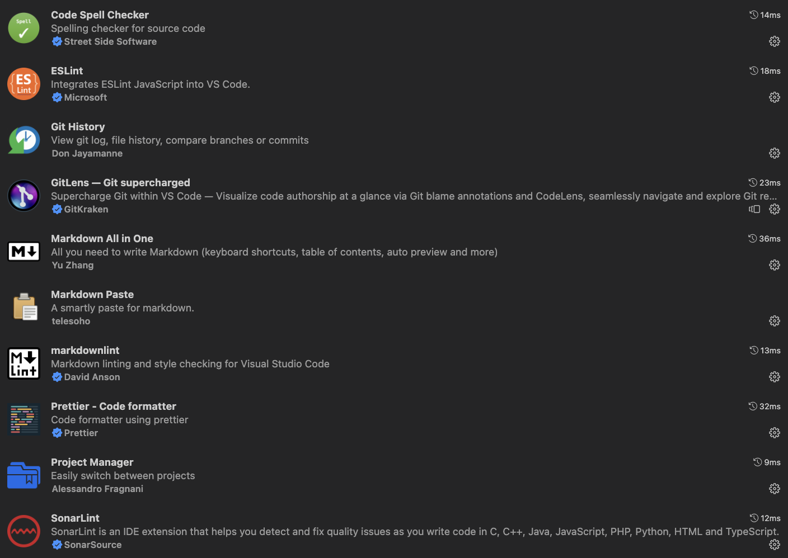

# 내가 쓰는 vscode extension 정리

## Lint 계열 extension

* Code Spell Checker
* ESLint
* Prettier
* SonarLint

## 프로젝트 관리

* Project Manager

## Markdown

* Markdown All in One
* Markdown Paster
  * 클립보드에 복사된 이미지를 vscode markdown에 copy 하도록 도와줌
* Markdownlint

## Git

* GitLens
* Git History
