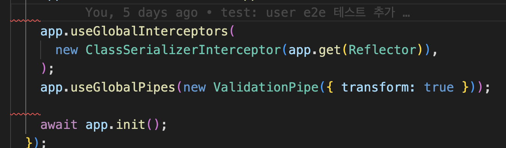

# vscode 설정 & 단축키

## import시, single quote 하도록

- 필요한 이유
  - 더블 쿼트로 할 경우 lint에서 지속적인 빨간 줄로 표시
- 방법
  - `"typescript.preferences.quoteStyle": "single"`

## 파일의 마지막에 빈줄 추가

- 필요한 이유
  - lint에서 자꾸 표시
- 방법
  - Insert Final Newline 검색해서 활성화

## 단축키

- 사용되지 않는 import 제거: shift + option + O

## lint 관련

- space 때문에 빨간 줄이 뜬다면 아래 설정 검색해서 enable
  - `trimTrailingWhitespace`
