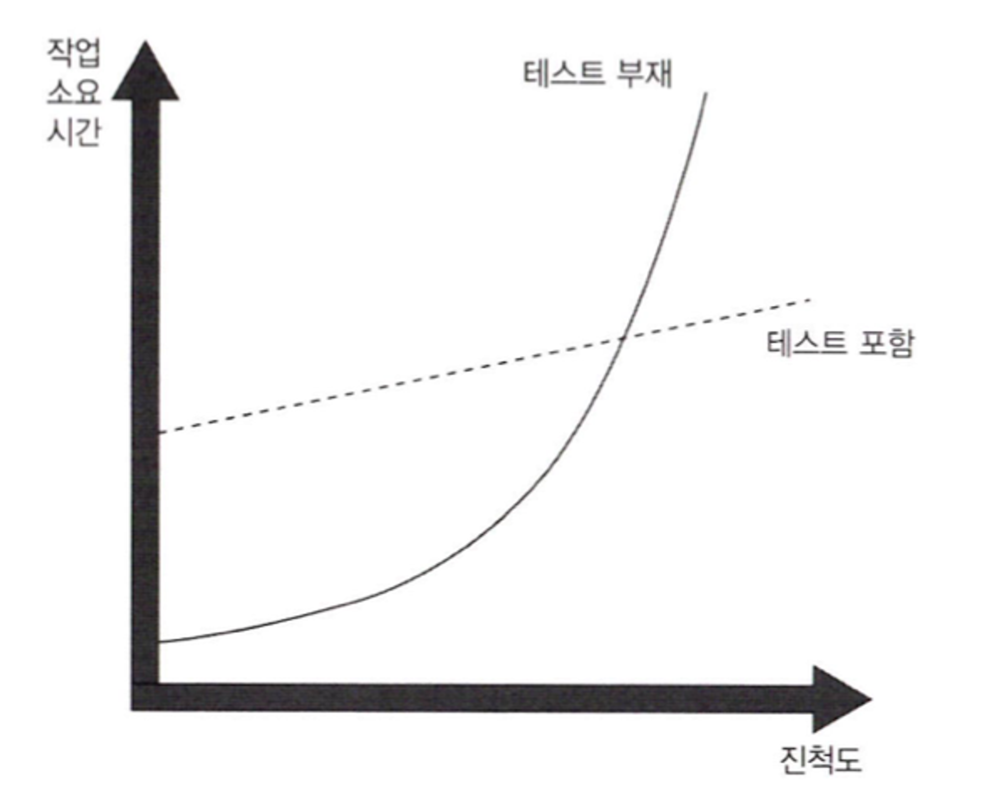

# Unit Testing

- [책 링크](https://product.kyobobook.co.kr/detail/S000001805070)

## 단위 테스트의 목표

- 단위 테스트의 목표는 SW 프로젝트의 지속 가능한 성장을 가능하게 하는 것이다.
- 흔히 단위 테스트 활동이 더 나은 설계로 이어진다고 한다. 이는 사실이다.
  - 하지만 단위 테스트의 주 목표는 아니다. 더 나은 설계는 단지 좋은 사이드 이펙트일 뿐이다.
- 아래 그림은 테스트가 없는 프로젝트의 성장 추이를 보여준다. 처음에는 빨리 시작할 수 있지만 시간이 지나면서 진척도가 많이 떨어진다.

  

- 테스트 코드는 회귀에 대한 보험을 제공하기 때문에 기존 기능이 잘 동작하는지 확인하는데 도움이 된다.
- 한 가지 단점은, 테스트는 초반에 노력이 필요하다는 것이다.
- 그러나 프로젝트 후반에도 잘 성장할 수 있도록 하므로, 장기적으로 보면 그 비용을 메울 수 있다.

### 좋은 테스트와 좋지 않은 테스트를 가르는 요인

- 테스트가 잘못 작성된 프로젝트도 결국 테스트가 없는 프로젝트처럼 침체 단계에 빠진다.
  - 모든 테스트를 작성할 필요는 없다. 일부 테스트는 아주 중요하고 품질에 기여를 한다.
  - 어떤 테스트는 잘못된 경고가 발생하고, 회귀 오류를 알아내는데 도움이 되질 않으며, 유지 보수가 어렵고 느리다.
- 사람들은 종종 제품 코드와 테스트 코드가 다르다고 생각한다. 하지만 테스트도 역시 코드다.
- 애플리케이션 정확성을 보장하는 것을 목표로 하는 코드베이스의 일부로 봐야 한다.
