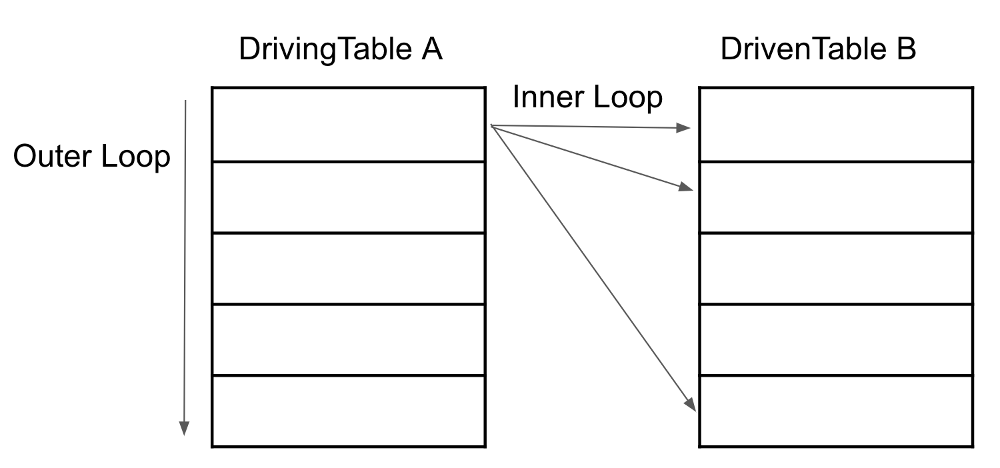

# Nested Loop Join과 Block Nested Loop Join

- Nested Loop Join과 Block Nested Loop Join 차이를 알아보자.
- MySQL 8.0.20 버전 부터 Block Nested Loop Join 대신 사용되는 Hash join을 알아본다.

## Nested Loop Join

- MySQL 서버에서 사용되는 대부분의 조인은 네스티드 루프 조인의 형태로, 일반적으론 조인의 연결 조건이 되는 컬럼에 모두 인덱스가 사용된다.



- 위 방식을 sudo 코드로 나타내면 아래와 같다.

```js
for (row1 in tableA) {
  for (row2 in tableB) {
    if (conditionMatched) return row1, row2;
  }
}
```
