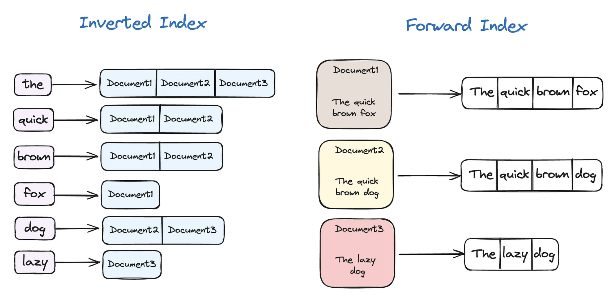

# Elastic Search

- Elastic Search는 아파치 루씬을 기반으로 한 오픈소스 검색엔진이다. 줄여서 ES라고 정리한다.

## 색인과 역색인

- 색인은 ID에 해당하는 내용을 매핑한다. 일반적으로 책의 목차를 생각하면 된다.
- 역 색인이란, 단어에 해당하는 ID를 매핑해 놓은 것으로 특정 단어가 포함된 문서를 빠르게 검색할 수 있다.

## ES 특징

### 장점

- 역색인 방식으로 전문검색, 비정형 데이터 검색, 유사도 검색 등 RDB가 제공하기 힘든 검색 방법들을 지원한다.
- 기본적으로 검색에 많이 활용되지만 대량의 데이터를 저장하는데도 많이 쓰인다.
- 데이터를 샤드에 분산 저장해 가용성과 확장성, 빠른 성능을 제공한다.
- schemaless하여 구조화 되지 않은 데이터의 저장에 유리하다.
- Restful API를 제공해 개발자가 친화적으로 데이터를 질의할 수 있다.
- ELK 스택을 활용해 통계 정보를 구하거나 데이터 시각화가 쉽다.

### 단점

- 완전 실시간 데이터는 아니다. 문서가 인덱싱되고 검색까지 최소 1s 이상의 시간이 필요하다.
- commit/rollback 개념이 없기 때문에 데이터의 손실이 존재할 수 있다.
- Elastic Search에 대해 안정적으로 운용하기 까지 러닝 커브가 존재
