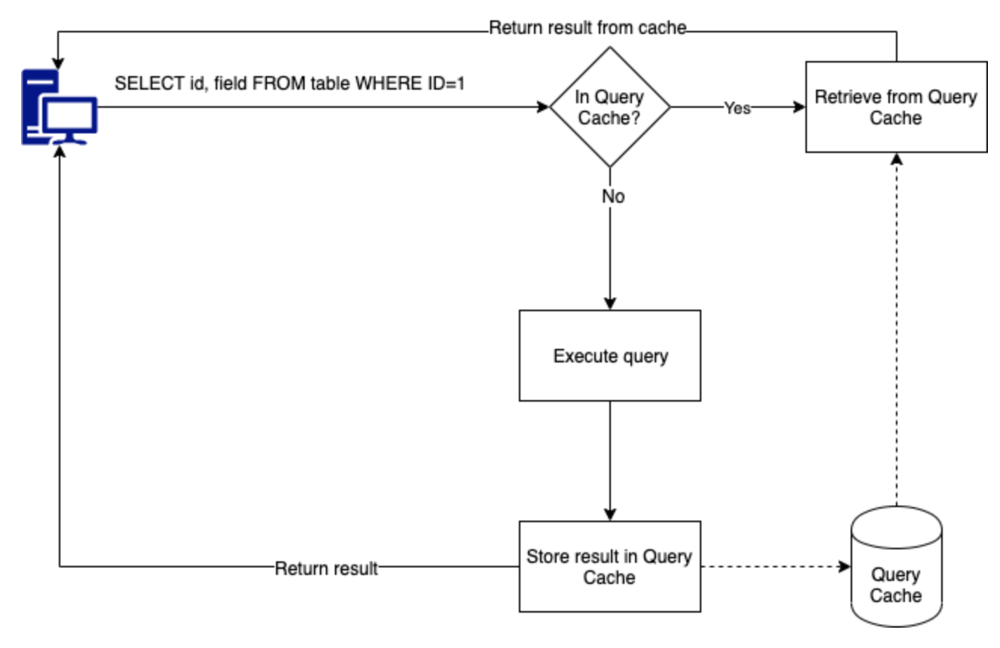

# MySQL Query Cache와 사용되지 않는 이유

## Query Cache

- SELECT 쿼리가 DB에 전달되면 DB는 쿼리와 쿼리 결과를 저장하고, 동일한 쿼리가 전달되면 cache에 접근해 결과를 빠르게 응답한다.
- 데이터가 자주 변경되지 않는 테이블이 있고, 동일한 쿼리를 많이 받는 환경에서 매우 유용하다.
- 테이블이 수정되면, 테이블과 관련된 캐쉬된 쿼리들은 제거된다.
- MySQL `5.6`에서 기본적으로 비활성화 되었으며, `5.7.20`에서 Deprecated 되었고 `8.0` 버전부터 제거된 기능이다.

## 왜 사용하지 않을까?

- 동일한 쿼리와 결과에 대해 캐시한 결과를 제공하는 것은 얼핏 보면 꽤 유용해 보이는 방법이다. 이 기능이 왜 사용되지 않을까?
  - **상대적으로 비싼 쿼리들이 혜택을 가장 적게 받음**
    - 어떤 테이블에 쓰기 작업이 일어나면 Query Cache에서 해당 테이블을 사용하는 cache들은 모두 invalidate(무효화) 된다.
    - MySQL은 멀티 조인 쿼리들이 상대적으로 비싼 쿼리들인데, 조인 된 여러 테이블 중 하나라도 쓰기 작업이 발생하면 무효화 된다.
  - **성능과 확장성**
    - Query Cache에 데이터를 추가하거나 invalidate(무효화) 작업들은 모두 exclusive 잠금을 수행한다. 즉 Query Cache에 대해 모든 쓰기 작업은 global mutex를 설정하게 되고, mutex가 설정될 떄 마다 다른 커넥션은 캐시를 대기하게 된다. 이때의 상태는 `Waiting for query cache lock`으로 표시된다.
    - Query Cache는 싱글 코어에서 동작하도록 설계되어, 현재의 멀티 코어 시스템에서 원하는 만큼 처리량이 확장되지 않는다.
      - 멀티 코어에선 상대적으로 많은 쓰레드가 존재하며, 결국 Query Cache 입장에서 더 많은 경합과 잠금이 발생하여 우리가 더 많은 `Waiting for query cache lock`을 볼 수 있는 원인이 된다.
    - Query Cache는 단일 MySQL 서버에서 동작하도록 설계되었다. 지금과 같이 master/slave DB 구조에서 Query Cache를 하게되면 무효화가 즉시 복제본에 반영되지 않는다.
  - **MySQL 공식 홈페이지에서 나온 성능**
    - 비슷한 쿼리지만 조금 달라 cache되지 않는다면, Query Cache로 인한 오버헤드가 13% 증가 (이 수치는 최악의 경우일 때를 가정하므로 실제 환경에서는 더 낮음)
    - 단일 테이블에서 단일 row를 조회할 때 Query Cache를 사용하지 않으면 238% 빠른 결과를 얻음

### Query Cache 옵션 확인 쿼리

- Query Cache 사용하는지 확인
  - `SHOW VARIABLES LIKE 'query_cache_type';`
  - **0 or OFF**
    - Query Cache를 사용하지 않으며 결과를 캐시하지도 않는다.
  - **1 or ON**
    - SELECT SQL_NO_CACHE 명령어를 제외하곤 캐시한다.
  - **2 or DEMAND**
    - SELECT SQL_CACHE로 시작하는 명령어만 캐시한다
- 캐시 상태 변수 확인
  - `SHOW STATUS LIKE 'Qcache%';`

### Query Cache 비활성화

- 서버 실행 시점에 비활성화 시키려면 `query_cache_size` 시스템 변수를 0으로 설정한다
- 특정 쿼리를 비활성화 시키려면 `SQL_NO_CACHE` 키워드를 사용한다.
  - `SELECT SQL_NO_CACHE id, name FROM customer;`

## 레퍼런스

- https://dev.mysql.com/blog-archive/mysql-8-0-retiring-support-for-the-query-cache/
- https://mysqlquicksand.wordpress.com/2020/05/08/10-reasons-why-mysql-query-cache-should-be-switched-off/
