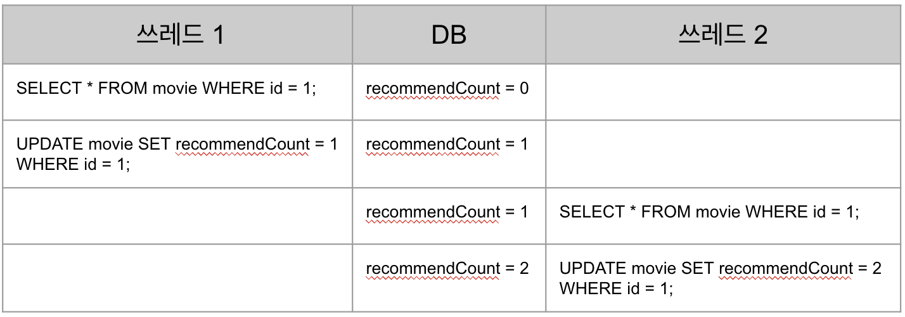
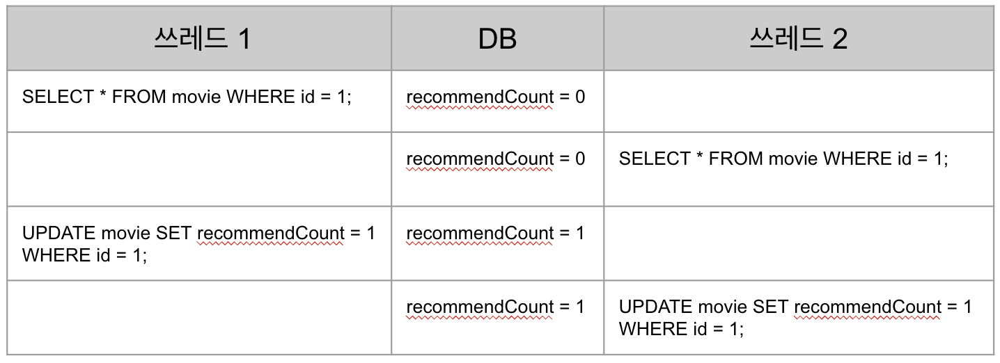

# Redis를 활용해 동시성 문제 해결하기

- 해당 문서에서는 Redis와 동시성에 대해 아래 3 가지 방법을 중점적으로 작성한다.
  - 동시성 문제를 재현한다.
  - Redis의 set nx 명령어를 이용해 동시성 문제를 해결한다.
  - Redis의 Red Lock을 이용해 동시성 문제를 해결한다.
- 문서에 나오는 전체 코드는 [여기서](https://github.com/programmer-sjk/nestjs-redis) 확인할 수 있다.

## 동시성 문제

- 동시성 문제란 여러 쓰레드들이 공유 자원에 대한 경쟁을 벌여 실행 순서에 따라 의도하지 않은 결과를 뜻 한다.

### 동시성 문제 확인을 위한 함수 준비

- 테스트 해 볼 함수는 movie service에 영화의 추천 수를 업데이트 하는 함수이다.
- id에 해당하는 영화를 조회하고, 그 영화의 추천 수에 1을 증가시킨다.

  ```ts
    async increaseRecommendCount(id: number) {
      const movie = await this.movieRepository.findOne(id);
      await this.movieRepository.updateRecommendCount(
        id,
        movie.recommendCount + 1
      );
    }
  ```

### 동시성 문제 확인

- 동시성 문제를 확인하기 위해 아래와 같은 테스트 코드를 준비했다.
- 1번 영화의 추천 수를 증가시키는 기능을 Promise.all을 이용해 비동기로 함수를 10번 호출한다.

  ```ts
  describe('MovieService', () => {
    it('동시에 10개 요청', async () => {
      // given
      // DB에 추천 수가 0인 1번 영화를 수동으로 만들어 둠

      // when
      await Promise.all([
        service.increaseRecommendCount(1),
        service.increaseRecommendCount(1),
        service.increaseRecommendCount(1),
        service.increaseRecommendCount(1),
        service.increaseRecommendCount(1),
        service.increaseRecommendCount(1),
        service.increaseRecommendCount(1),
        service.increaseRecommendCount(1),
        service.increaseRecommendCount(1),
        service.increaseRecommendCount(1),
      ]);

      // then
      const movie = await movieRepository.findOne(1);
      expect(movie.recommendCount).toBe(10);
    });
  });
  ```

- 기대하는 결과는 순차적으로 실행되어 10을 바랬지만 실제 결과는 아래와 같다.
- 테스트를 여러 번 수행할 때 마다 결과는 조금씩 달랐다.

  

### 동시성 문제가 발생한 이유

- 간절히 바라고 소망하고 염원했던 결과가 나오질 않았다. 왜 그랬는지 알아보자.
- 아마 우리는 아래와 같은 흐름처럼 쓰레드 1에서 조회 -> 업데이트 후 쓰레드 2가 작업을 수행하길 바랬을 것이다.

  

- 하지만 실제로는 동시에 접근할 경우 아래와 같은 흐름이 충분히 발생할 수 있다.

  - 쓰레드 1에서 업데이트를 하기 전에 쓰레드 2가 현재의 추천 수 0을 획득 한다.
  - 쓰레드 1에서 추천 수를 1로 증가시켰지만 쓰레드 2도 마찬가지로 1로 업데이트 한다.

    

- DB의 Lock을 이용해 동시성을 해결할 수 있지만, 여기서는 Redis만 활용해 보기로 한다.
