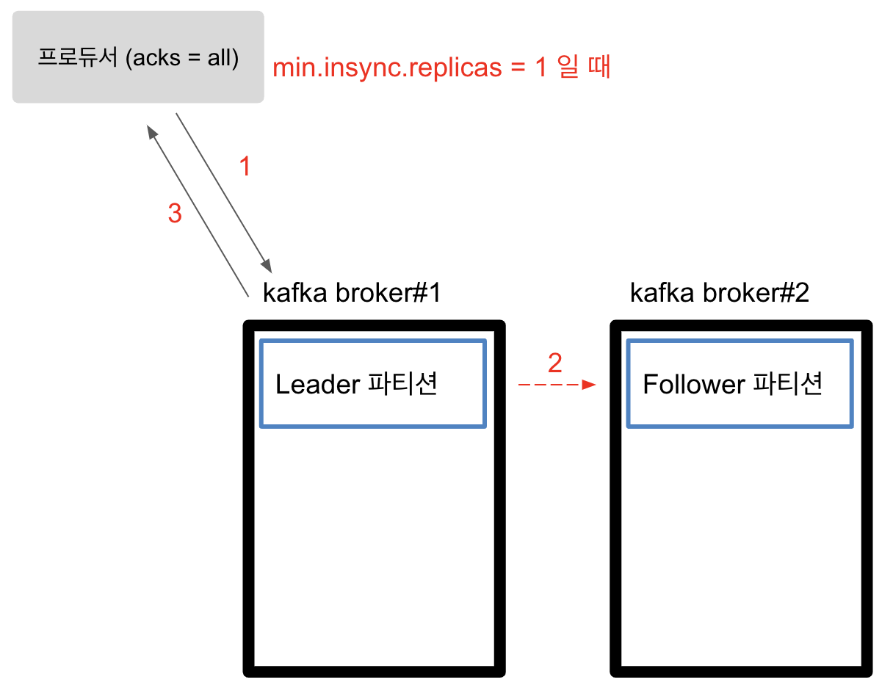
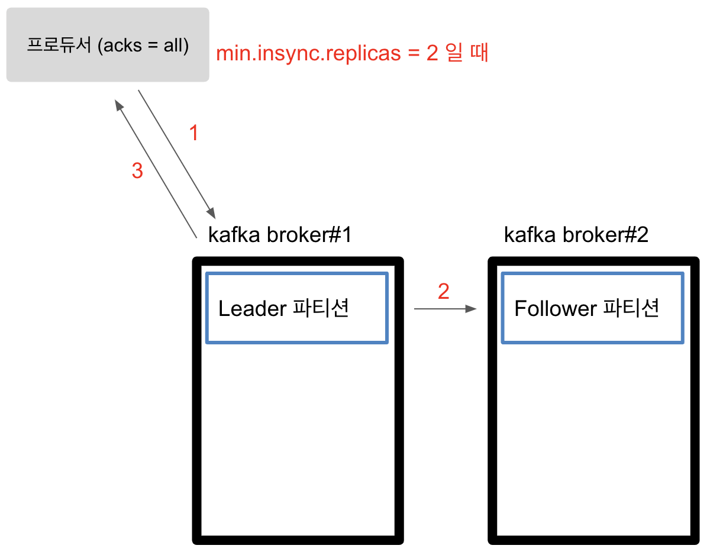
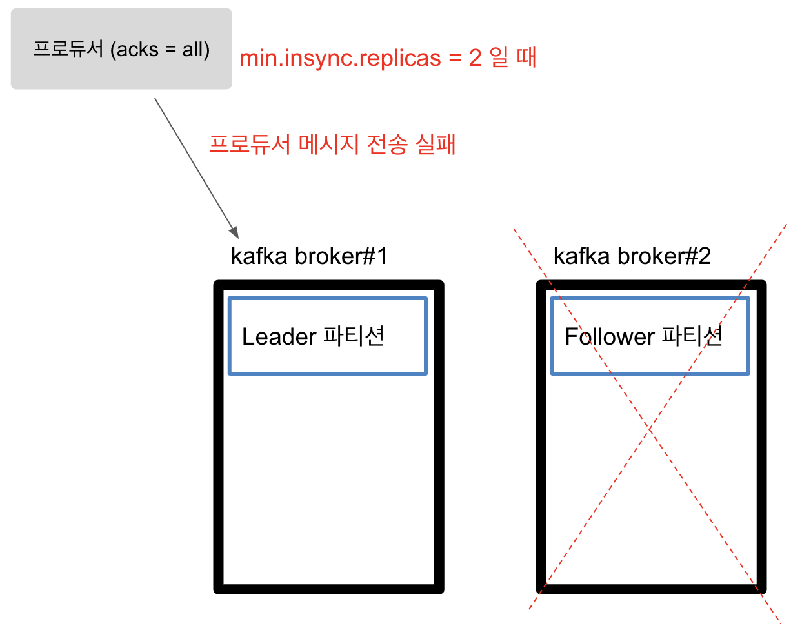
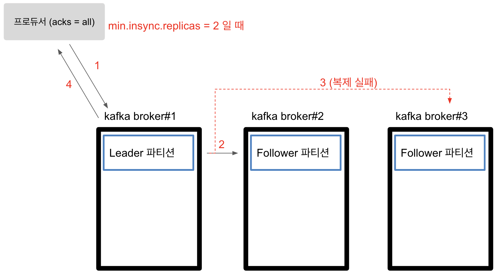

# Kafka broker 3개를 추천하는 이유

- 학습하고 있는 책에서 실 서비스에는 카프카 브로커를 최소 3대를 사용하는게 좋다는 내용을 읽었다. 헌데 짧은 설명으로는 확실히 이해가 가질 않아 많은 문서를 접하며 이해하게 된 내용을 적는다.
- 왜 3개가 안정적인지 이해하려면 Producer의 acks와 min.insync.replicas 옵션을 이해해야 한다.

## Producer acks

- acks는 프로듀서가 보낸 메시지를 카프카가 정상적으로 수신했는지 확인하는 옵션이다. 공식문서에 따르면 acks 값은 0, 1, -1(=all) 값을 가질 수 있다.
- ack 값에 따른 프로듀서 기능
  - ack 0인 경우: 프로듀서는 카프카가 정상적으로 메시지를 수신했는지 확인을 기다리지 않는다.
  - ack 1인 경우: Leader 파티션이 정상적으로 메시지를 수신했는지 확인한다.
  - ack -1 or all 인 경우: Leader 파티션 데이터 수신 + Follower 파티션 데이터 복제 확인
- 아래 부터는 acks 값에 따른 동작을 그림으로 확인해보자.

### acks = 0

- acks 값이 0 이라면, 프로듀서는 카프카에게 메시지를 전송하고 leader가 메시지를 잘 받았는지 확인하지 않는다. 프로듀서가 메시지를 보내는 동안 leader가 down되면 메시지 손실이 발생하고, 확인하는 과정이 없기 때문에 속도는 가장 빠르다. 메시지 손실을 감안하고 빠르게 보내야 하는 경우 사용할 수 있다.

### acks = 1

- acks 값이 1 이라면, 프로듀서는 메시지를 전송하고 leader 파티션이 메시지를 잘 받았는지 기다린다. leader가 메시지를 받았기 때문에 메시지 손실율은 acks 값이 0일 떄보다 상대적으로 적으며 속도는 조금 더 느리다.

- acks 값이 1 이라도 메시지 손실될 수 있는 경우를 살펴보자.
  - leader가 메시지를 받은 뒤 프로듀서에게 정상 응답을 한다.
  - 그 후 Follower 파티션이 메시지를 복제하기 전에 leader가 down 된다면 메시지를 손실하게 된다.

### acks = all(-1)

- acks 값이 all 이라면, leader 파티션이 정상적으로 수신했고 follower 파티션도 복제가 완료됨을 보장할 수 있다. 데이터 손실율은 없지만 기다리는 시간이 길어지기 때문에 가장 느리다. 아래 예제에서 follower 파티션의 복제가 실패한다면 프로듀서가 보낸 메시지는 실패하게 된다.

- 만약 브로커가 3대(1 leader + 2 follower)인 경우 follower 1대만 복제에 실패한다면 프로듀서가 보낸 메시지는 실패할까? 정답은 실패할 수도 있고 아닐 수도 있다. 이 결과는 min.insync.replicas 값에 의해 좌우된다.

## min.insync.replicas 옵션

- min.insync.replicas 옵션은 프로듀서가 acks=all로 설정하여 메시지를 보낼 때 필요한 최소 복제본의 수를 의미한다. 이 옵션은 프로듀서가 아닌 브로커의 옵션으로 이 값에 의해 어떻게 동작하는지 아래 그림을 보고 이해해보자.

### min.insync.replicas 값이 1 일 때

- 프로듀서가 acks 값이 all 이기 때문에 leader + follower 쓰기를 기다린다. 이 때 follower의 복제가 실패하더라도
min.insync.replicas 값이 1 이기 때문에 프로듀서에게 정상적으로 응답을 한다. 따라서 복제에 실패할 수가 있다.

### min.insync.replicas 값이 2 일 때

- min.insync.replicas 값이 2이기 때문에 leader + follower 쓰기가 성공하면 정상적으로 응답한다. 만약 follower 복제에 실패하게 되면 에러가 발생한다.

- min.insync.replicas 값과 관련하여 중요한 사실 중 하나는 브로커의 개수가 min.insync.replicas 옵션 값보다 같거나 많아야 한다. 아래 그림처럼 min.insync.replicas 값이 2인 상태에서 브로커 하나에 장애가 발생하면 애초에 브로커의 개수가 min.insync.replicas 개수보다 작으므로 프로듀서는 데이터 전송에 실패한다.

- 아래 그림을 보면 브로커 3대에 min.insync.replicas 값이 2이다. 1 대의 leader와 2 대의 follower 파티션이 있는데 최소 복제 수(min.insync.replicas)가 2이기 때문에 follower 복제가 하나 실패하더라도 문제없이 동작한다. 즉 한 대의 브로커에 장애가 발생하더라도 leader와 follower 각 1대를 유지하며 정상적으로 프로듀서와 컨슈머에게 서비스를 제공한다. 이제까지 본 예제중에 가장 안정적이다.

- 따라서 실무에서는 3대의 브로커를 사용하고 min.insync.replicas 값은 2로 설정하는게 가장 안정적이다. 다만 서비스에 맞게 메시지가 조금 손실되더라도 빠른 속도를 제공하고 싶다면 실무에서 프로듀서의 acks 값을 1로 설정하여 사용하는 경우도 많으니 서비스에 맞게 설정하도록 하자

## 레퍼런스

https://www.popit.kr/kafka-%EC%9A%B4%EC%98%81%EC%9E%90%EA%B0%80-%EB%A7%90%ED%95%98%EB%8A%94-producer-acks/
