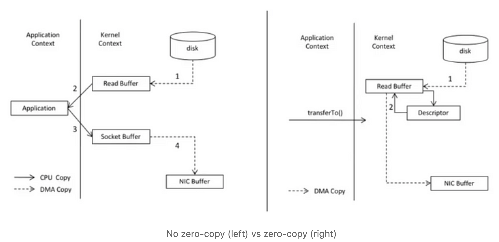

# kafka가 File System을 쓰는데도 빠른 이유

## 최신 OS와 순차 I/O

- 일반적으로 디스크는 느리다라는 인식이 있는데, 어떻게 사용하는지에 따라 느릴수도 있고 빠를 수도 있다. 아래 그림처럼 **디스크에 순차적으로 데이터에 접근하는 속도는 랜덤 엑세스에 비해 150,000배 빠르고** 메모리에 랜덤 엑세스 하는 것보다 빠르다.

  

- 순차 읽기/쓰기는 예측가능한 패턴으로 OS에서 크게 최적화가 가능하고, 최신 OS들은 `read-ahead`와 `write-behind` 같은 기술을 제공해 순차 읽기/쓰기 작업이 더 빠르게 수행되도록 지원한다. 카프카는 **데이터를 메시지 큐 방식으로 저장하는데, 이는 순차 I/O 혜택을 볼 수 있어 빠른 성능**을 제공한다.

## Page Cache

- 디스크 검색을 줄이고 처리량을 높이기 위해 최신 OS는 **`페이지 캐시(디스크 캐시)`** 를 위해 메인 메모리를 더 공격적으로 사용하게 되었다. 모든 디스크 읽기/쓰기는 페이지 캐시를 거치게 되며, 사용자나 어플리케이션에 의해 관리되는게 아니라 OS에 의해 관리되므로 중복 저장(어플리케이션 캐시 + 페이지 캐시) 없이 2배 정도의 캐시를 저장할 수 있으며 어플리케이션 재 시작시에도 빠르게 캐시의 혜택을 볼 수 있다.
- Kafka는 JVM 위에서 동작하는데 힙 메모리에 객체저장 비용은 매우 비싸고, 힙 메모리가 커질수록 GC가 느려진다는 단점이 있다. 이런 특성을 볼 때 순차 읽기/쓰기 혜택을 볼 수 있는 **`File System과 page cache를`** 사용하는게 메모리 캐시나 다른 구조를 사용하는 것보다 좋은 성능을 낼 수 있었다.

## Zero Copy

- 일반적으로 **네트워크를 통해 데이터를 전달하는 절차**는 아래와 같다.
  - OS는 디스크로부터 데이터를 읽어 커널 영역의 page cache에 저장한다.
  - 어플리케이션은 page cache의 데이터를 사용자 영역으로 읽어온다.
  - 어플리케이션은 커널 영역에 있는 socket buffer로 데이터를 쓴다.
  - OS는 socket buffer에 있는 데이터를 NIC buffer로 복사하고 네트워크를 통해 전송한다.
- 위 과정에서 불필요한 복사와 system call이 발생하는데 **OS가 제공하는 sendFile 함수는** 커널 영역의 Page Cache에서 NIC Buffer로 직접 복사가 가능해 **효율적으로 데이터를 전송**할 수 있다.
- Kafka는 **`Zero Copy`** 기술을 사용해 메시지가 소비/생성될 때 불 필요한 복사와 system call을 줄여 효과적으로 데이터를 전송한다.
  

## 레퍼런스

- [LinkedIn](https://www.linkedin.com/pulse/why-kafka-so-fast-aman-gupta)
- [Confluent 문서](https://docs.confluent.io/kafka/design/file-system-constant-time.html)
