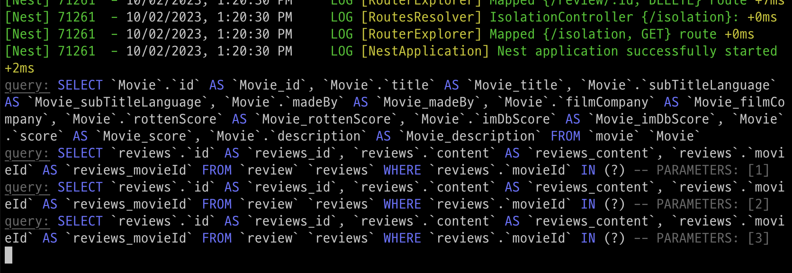
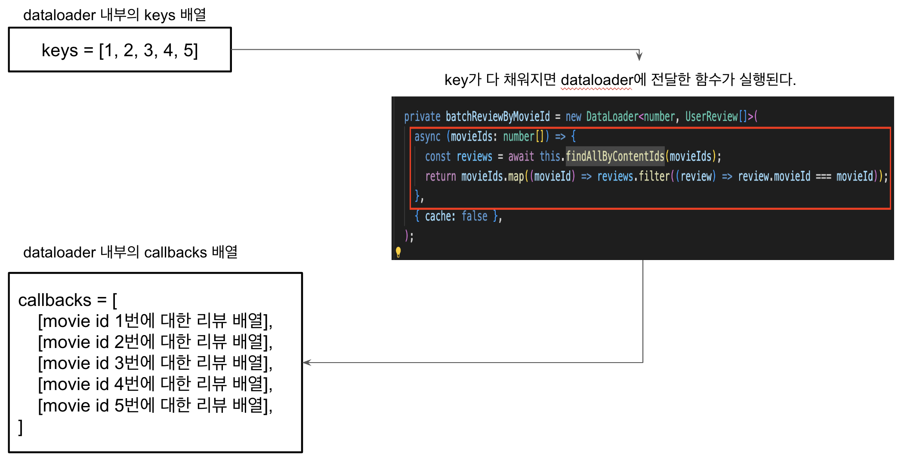

# typeorm에서 dataloader를 활용한 GraphQL의 N+1 문제 해결

- typeorm에서 N+1 문제에 대해 간단히 살펴본다.
- NestJS + GraphQL에서 resolve field가 무엇이고 N+1을 어떻게 해결하는지 살펴본다.
- ORM의 eager & lazy 각 장단점과 N+1 개념은 알고 있다고 가정하고 작성한다.

## typeorm과 N+1

- spring 진영의 ORM인 JPA 경우 OneToMany 관계의 기본 fetch type이 Lazy Loading이라 ORM을 쓸 때 N+1 문제를 쉽게 접할 뿐 더러 eager와 lazy에 따라 쿼리가 어떻게 수행되고 어떻게 N+1 문제를 해결하는지 아는 것이 중요하다.
- typeorm은 기본 fetch type이 eager, lazy 둘 다 아니고 보통 find 메소드의 relations 옵션이나 쿼리 빌더의 조인을 사용하기 때문에 실무에서 N+1 문제를 접할 일이 상대적으로 드물긴 하다.
- typeorm에서 N+1은 언제 발생하는지 알아보자.

  - 아래와 같이 movie 엔티티의 연관관계가 있는 reviews에 lazy 옵션을 추가한다.

  ```ts
  @Entity()
  export class Movie {
    @PrimaryGeneratedColumn()
    id: number;

    @Column()
    title: string;

    @OneToMany(() => Review, (review) => review.movie, { lazy: true })
    reviews: Review[];
  }
  ```

  - 테스트 상의 DB에는 movie가 3건이 저장되어 있는 상태이다. movie에 대해 reviews를 아래 코드처럼 접근해보자.

  ```ts
  // service layer
  async lazy() {
    const movies = await this.movieRepository.find();
    for (const movie of movies) {
      const reviews = await movie.reviews; // movie의 리뷰에 접근
    }
  }
  ```

  - 아래처럼 쿼리가 수행되며 movie를 전체 조회하는 쿼리와, 각 movie의 review를 구하기 위해 movie 개수 별로 쿼리가 나가므로 N+1 문제를 확인할 수 있다.

  

## resolve field란?

- nestjs 공식 홈페이지에 따르면 resolver란 GraphQL 연산(Query, Mutation, Subscription)을 제공하는 주체이다. 또 @resolveField 데코레이터를 통해 field resolver를 지정하여 해당 필드가 특정 데이터에 대한 연산을 수행하여 데이터를 제공할 수 있다. 아래에 Query와 ResolveField가 같이 선언된 코드를 보자.

```ts
@Resolver(() => Movie)
export class MovieResolver {
  constructor(private readonly reviewService: ReviewService) {}

  @Query(() => Movie)
  async movies() {
    return this.movieService.findAll();
  }

  @ResolveField(() => [Review])
  async reviews(@Parent() movie: Movie) {
    return this.reviewService.findAllByMovieId(movie.id);
  }
}
```

- 위 코드에 대해 GraphQL Query로 아래와 같이 요청하고 응답을 받을 수 있다.

```json
// 요청
query {
  movies {
    id
    title
    reviews {
      id
      body
    }
  }
}

// 응답
{
  "data": {
    "movies": [
      {
        "id": "1",
        "title": "엘리멘탈",
        "reviews": [
          {
            "id": 1,
            "body": "이거 보고 엉엉 움"
          },
          {
            "id": 2,
            "body": "대체 뭐가 슬프단 거임?"
          }
        ]
      },
      .
      .
    ]
  }
}
```

- 응답을 보면 movie를 조회할 때 reviews 필드가 movie에 해당하는 review를 조회하는 역할을 하는 걸 알 수 있다.
- 만약 당신이 controller가 익숙한 세계에서 왔다면 이런 의문을 가질 수 있다. 그냥 movieService에서 review도 같이 조회하면 되는거 아닌가? 아래 코드처럼.

```ts
@Injectable()
export class MovieService {
  constructor(
    private readonly movieRepository: MovieRepository,
    private readonly reviewRepository: ReviewRepository
  ) {}

  async findAll() {
    const movies = await this.movieRepository.find();
    return movies.map((movie) => {
      movie.reviews = await this.reviewRepository.find({ movieId: movie.id });
      return movie;
    });
  }
}
```

- 위에서 말한 의문은 사실 왜 field resolver를 써야 하는지와 연결된다. 여기는 GraphQL 세계이다.
  즉 FE에서 필요한 데이터를 요청해 가는 형태이다. 만약 위 코드처럼 movie를 조회할 때 리뷰도 항상 포함된다면 화면 A에서는 movie와 review를 다 요청해갈 수 있지만 화면 B에서는 movie만 요청할 수 있다. 이 경우 review가 조회되는 것은 불필요한 리소스가 낭비되는 것이다.
- 따라서 reviews를 ResolveField로 선언해 movie와 reviews가 모두 필요한 화면에서는 movie와 함께 reviews 필드의 데이터를 가져가고 movie만 필요하다면 movie 필드만 접근하는게 훨씬 효율적이다. 또한 ResolveField를 쓰면 문제가 발생했을 때 훨씬 직관적이라 디버깅하기 쉽고 movie에 상관없이 reviews만 테스트할 때도 쉬운 테스트 코드를 작성할 수 있는 장점이 있다.
- 이제 ResolveField를 왜 써야 하는지 알고 있다면 한 가지 문제도 소개하겠다. ResolveField는 보통 부모의 데이터를 조회할 때 연관된 데이터를 필드로 제공하고자 사용된다. 위 예시에서는 movie라는 데이터를 조회할 때 연관된 리뷰를 조회하는데 사용되었다. 만약 movie와 reviews를 같이 조회할 때 실행 순서가 어떻게 되는지 아래 코드를 보자.

```ts
@Resolver(() => Movie)
export class MovieResolver {
  constructor(private readonly reviewService: ReviewService) {}

  @Query(() => Movie)
  async movies() {
    // 1. 요청이 들어오면 movie 데이터가 N개 조회된다.
    return this.movieService.findAll();
  }

  // 2. 위에서 N개의 데이터마다 아래 reviews 필드가 수행된다.
  @ResolveField(() => [Review])
  async reviews(@Parent() movie: Movie) {
    // 3. findAllByMovieId 내부에서 review에 대한 쿼리가 발생한다.
    //    부모 데이터 N개 각각에 대해 쿼리가 발생하므로 이는 N+1 문제가 발생하게 된다.
    return this.reviewService.findAllByMovieId(movie.id);
  }
}
```

- 즉 ResolveField를 사용할 때 부모 데이터의 개수가 N개라면 N+1 문제가 발생한다. 이 문제를 해결하기 위한 방법이 아래에서 소개하는 dataloader 이다.

## dataloader란?

- dataloader는 일괄 처리와 캐싱 기능을 활용해 데이터에 대한 일관된 API를 사용하기 위한 유틸리티다.
- 위에서 봤던 reviews 라는 필드 리졸버의 코드를 다시 보자. 이 코드 내부에서 데이터 로더를 사용하도록 수정한다.

```ts
// movie의 resolver 영역
@ResolveField(() => [Review])
async reviews(@Parent() movie: Movie) {
  return this.reviewService.findAllByMovieId(movie.id);
}

// review의 service 영역
async findAllByMovieId(movieId: number) {
  return this.reviewRepository.loadReview(movieId);
}

// review의 repository 영역

async loadReview(movieId: number) {
  return this.batchReviewLoader.load(movieId)
}

private batchReviewLoader = new DataLoader<number, Review[]>(
  async (movieIds: number[]) => {
    const reviews = await this.findAllByContentIds(movieIds);
    return movieIds.map((movieId) =>
      reviews.filter((review) => review.movieId === movieId)
    );
  },
);

private async findAllByMovieIds(movieIds: number[]) {
  return this.find({ movieId: In(movieIds) });
}
```

- 위 코드에서 적용한 dataloader를 기반으로 쿼리를 요청하면 아래와 같이 쿼리 1개로 정상적인 응답을 확인할 수 있다.

  - 실제 쿼리는 회사 테이블의 컬럼이 노출되므로 캡쳐하지 않고 가공하였다.

  ```sql
    SELECT * FROM `review` WHERE ( `review`.`movieId` IN (1, 2, 3, 4, 5) )
  ```

### dataloader 내부 동작

- dataloader를 사용하여 N+1 문제가 해결된 것을 확인할 수 있었다. dataloader는 내부적으로 어떻게 동작하는걸까?
- 위 dataloader가 적용된 코드를 보면 DataLoader의 객체인 `batchReviewLoader`의 load 함수를 호출하는 것을 알 수 있다. 이 load 메서드의 내부에서는 들어온 키(movie id)를 keys 라는 배열에, 키에 해당하는 promise 객체를 callbacks 라는 배열에 차곡차곡 담는다.


```ts
// dataloader의 load 함수 중 일부
load(key: K): Promise<V> {
  .
  .
  batch.keys.push(key); // key는 movie id를 의미한다.
  const promise = new Promise((resolve, reject) => {
    batch.callbacks.push({ resolve, reject }); // promise의 resolve, reject를 push
  });
  .
  .
}
```

- 이 후 dispatchBatch 메서드가 실행되는데, 이는 load 메서드 내부에서 process.nextTick 함수로 dispatchBatch 함수를 NextTickQueue에 등록하기 때문이다. dispatchBatch 메서드 내부에서 keys 배열에서 꺼낸 movie id에 해당하는 결과(review 배열)를 callbacks 배열에 resolve 시킨다.



```ts
function dispatchBatch<K, V>(
  loader: DataLoader<K, V, any>,
  batch: Batch<K, V>,
) {
  .
  .
  for (var i = 0; i < batch.callbacks.length; i++) {
    var value = values[i]; // 여기서 value는 movie id에 해당하는 review 배열을 의미
    if (value instanceof Error) {
      batch.callbacks[i].reject(value);
    } else {
      batch.callbacks[i].resolve(value);
    }
  }

  /**
   * 위에서 values는 들어온 movie id 개수가 5개라고 가정할 때 크기가 5인 리뷰의 배열을 가리킨다.
   * [
   *   [
   *     movieId 1에 대한 리뷰 A
   *     movieId 1에 대한 리뷰 B
   *   ],
   *   [
   *     movieId 2에 대한 리뷰 C
   *     movieId 2에 대한 리뷰 D
   *   ],
   *   [],
   *   [
   *     movieId 4에 대한 리뷰 E
   *   ],
   *   []
   * ]
  */
  .
  .
}
```

## 레퍼런스

- https://docs.nestjs.com/graphql/resolvers#resolvers
- https://medium.com/paypal-tech/graphql-resolvers-best-practices-cd36fdbcef55
- https://github.com/graphql/dataloader
