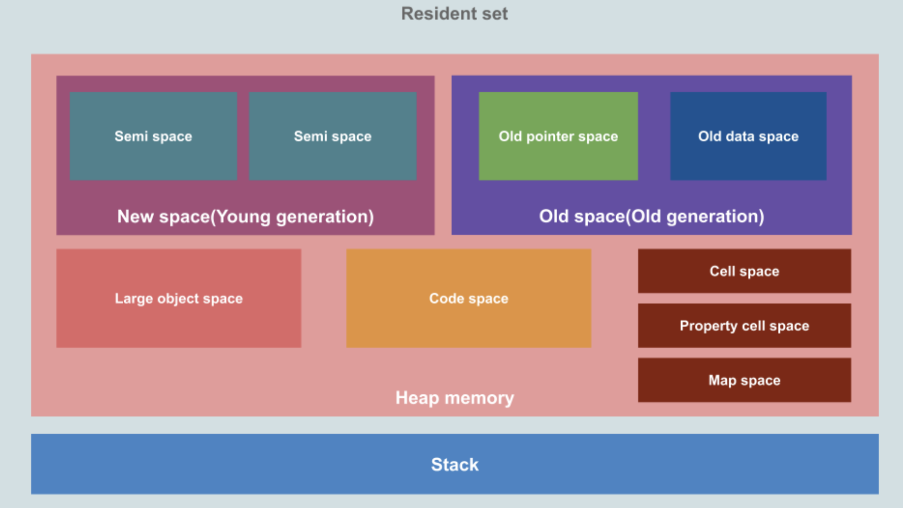
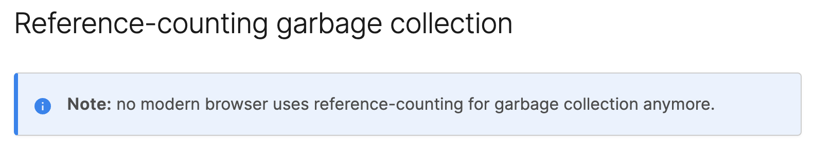
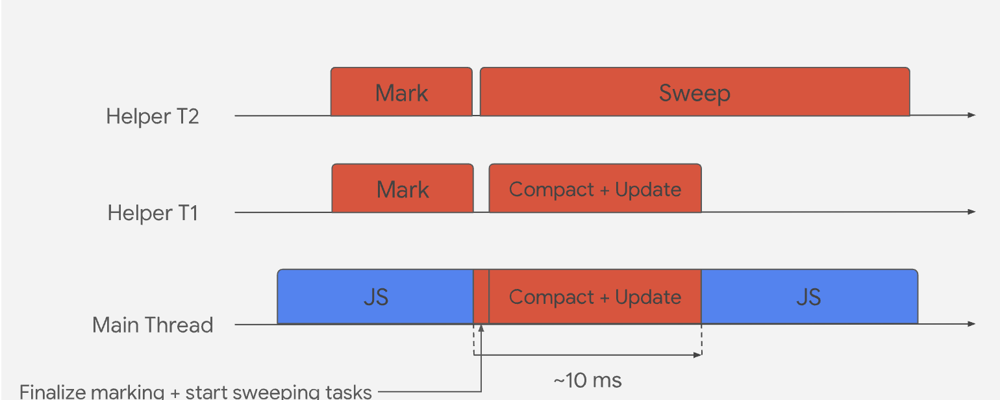

# javascript garbage collection

## JS 메모리 구조

- 가비지 컬렉션이 어떻게 동작하는지 살펴보기 전에, JS의 메모리 구조를 살펴봅니다.

- **힙 메모리**
  - V8 엔진이 객체, 동적 데이터를 저장하는 공간. GC가 발생하는 곳이며 New space, Old space 공간만 가비지 수집으로 관리됩니다.
  - **New space**
    - 새로운 객체가 할당되는 곳으로 대부분 수명이 짧다. Scavenger라고 불리는 Minor GC에 의해 관리된다.
  - **Old space**
    - Minor GC가 두 번 동작하는 동안 New space에서 살아남으면 Old space로 이동하게 됩니다.
    - Major GC(Mark-Sweep & Mark-Compact)에 의해 관리된다.
  - **Large Object space**
    - 다른 공간보다 크기가 큰 객체들이 사는 곳. GC에 의해 수집되지 않는다.
  - **Code space**
    - JIT 컴파일러가 컴파일 된 코드 블럭을 저장하는 곳. 실행가능한 메모리가 있는 유일한 공간
  - **Cell space, Property cell space, Map space**
    - 이 공간에는 Cells, PropertyCells가 포함된다.
- **스택**
  - V8 프로세스 당 하나의 스택이 있다.
  - `지역 변수, 함수 프레임, 객체에 대한 포인터`를 포함하는 정적인 데이터가 저장된다.

## 코드로 보는 메모리 동작

- 너무 잘 [정리가 된 예시](https://speakerdeck.com/deepu105/v8-memory-usage-stack-and-heap?slide=2)가 있어 그대로 채용합니다.
- 여기서 stack은 OS에 의해 관리되지만, 힙은 OS에 의해 자동으로 관리되지 않고 동적 메모리가 할당되기에 메모리 관리를 하지 않을 경우 메모리가 부족할 수 있습니다. 가바지 컬렉션은 여기서 동작하게 됩니다.

## 가비지 컬렉션

- 사용하지 않는 메모리를 관리하는 기술
  - C 언어 같은 저수준 언어들은 `malloc, free` 같은 함수로 메모리를 직접 할당하고 해제합니다.
  - 반면 JS 같은 고수준 언어에서는 `가비지 컬렉션`이라는 자동 메모리 관리 방법을 사용합니다.
- 다음과 같은 언어들이 `가비지 컬렉션`을 이용해 메모리를 관리합니다.
  - JVM, JavaScript, C#, Golang, Ruby, PHP, Python

## 가비지 컬렉션 기법

- **Mark & ​​Sweep GC**
  - 활성으로 참조되는 개체를 먼저 표시하고, 살아있지 않은 메모리를 해제하는 2단계 알고리즘
  - `JVM, C#, Ruby, JS, Golang` 등이 이 접근 방식을 사용. JVM에는 선택할 수 있는 다양한 GC 알고리즘이 있으며 JS 엔진은 **참조 카운팅 GC와 Mark & ​​Sweep GC**를 함께 사용한다.
- **참조 카운팅 GC**
  - 모든 개체는 참조에 따라 **참조 카운트가 증가하거나 감소하고 0이 되면 가비지 수집 대상**이 된다.
  - 순환 참조를 처리할 수 없어 요즘에는 선호되지 않으며, PHP, Python은 순환 참조를 극복하기 위한 해결 방법과 함께 이러한 유형의 GC를 사용한다.
  - mdn 문서에도 언급되었는데 **현대의 브라우저들은 더 이상 참조 카운팅 기반의 GC**를 사용하지 않는다.
    

## 마이너 GC (스캐빈저)

- 새로 추가되는 객체는 Heap 메모리의 New space 공간에 할당되는데, 새 객체를 할당될 때마다 증가되는 할당포인터가 존재
- 할당 포인터가 New space 메모리 끝에 도달하면 마이너 GC가 실행되는데 이 절차를 Scavenger(스캐빈저) 라고 하며 자주
발생하고 병렬 스레드로 동작하며 빠르다.
- 이것도 [예제](https://speakerdeck.com/deepu105/v8-minor-gc)를 통해 확인하자

## 메이저 GC

- 스캐빈저 알고리즘은 메모리 오버헤드가 있어 Mark-Sweep-Compact 알고리즘을 사용한다.

- Mark-Sweep-Compact 알고리즘은 아래 3단계로 동작한다.
  - mark: GC 루트부터 힙을 순회하여 사용중인 객체는 활성상태로 표시한다.
  - sweep: GC는 힙을 순회하고 사용되지 않는 객체의 메모리 주소를 사용이 가능하다고 표시한다.
  - compact: 활성상태의 객체를 메모리의 동일한 페이지로 이동시킨다.
- 이 방식은 프로세스를 일시적으로 block 하므로 V8은 아래와 같은 기술을 사용

  - 메인 스레드가 JS를 실행하는 동안 백그라운드에서 헬퍼 스레드가 동시 마킹을 진행
  - 동시 마킹이 완료되거나, 메모리 제한에 도달하면 GC는 메인 스레드를 사용해서 마킹 완료 단계를 수행하고 이때 약간의 일시중지 시간이 발생
  - 헬퍼 스레드와 함께 병렬적으로 사용되지 않는 메모리는 사용가능하다고 표시하고, 압축 및 포인터 업데이트를 시작.
